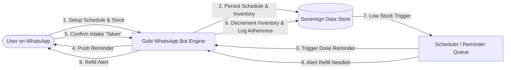

# Project Gobi

> **A sovereign personal medical assistant and records management platform.**

Project Gobi is built on the foundational principle of **data sovereignty**: providing individuals and families with a secure, private environment to manage their health records, medications, and clinical data without exposing sensitive medical information to third-party data brokers or risk-profiling insurance aggregators.

---

## 🌟 Core Principle: Data Sovereignty

Modern health platforms often monetize or leak patient data, creating risks of insurance premium inflation and unauthorized profiling. **Gobi** ensures:
- **Zero Third-Party Data Monetization:** User health data remains strictly personal and user-controlled.
- **Secure Access Control:** Time-bound, view-only sharing for doctor consultations and second opinions.
- **User-Owned Vault:** Centralized medical history, consultation transcripts, and diagnostics stored securely.

---

## 🎯 Target Demographics

1. **The Household Caregiver (Ages 30–45)**
   - Manages healthcare for 2 to 6 dependents (children, aging parents with chronic conditions like diabetes or hypertension).
   - Needs automated adherence tracking, inventory alerts, and consolidated family records.

2. **The Self-Diagnosing Professional**
   - Health-conscious professionals dealing with sedentary lifestyle challenges (fatigue, lethargy, nutritional deficiencies).
   - Needs lightweight tracking for vitals, fitness indicators, and daily supplement schedules (e.g., Vitamin D3, B12).

---

## 🚀 MVP Roadmap & Capabilities

| Module | Description | Status |
| --- | --- | --- |
| **WhatsApp Bot Assistant** | Natural conversational interface for schedules, reminders, and inventory. | **Phase 1 (PoC)** |
| **Dependent Management** | Dedicated profiles for up to 6 family members with distinct schedules. | Phase 2 |
| **Digital Report Archival** | Snap physical reports/prescriptions for OCR, indexing, and search. | Phase 2 |
| **Consultation Transcription** | Voice recording of doctor visits with clinical term extraction & follow-up tracking. | Phase 3 |
| **Secure Second Opinion Link** | Ephemeral, view-only links to share medical dossiers with consulting doctors. | Phase 3 |

---

## 📱 Phase 1 PoC: WhatsApp Bot Interface

To rapidly test user interaction rates and gather behavioral data with minimal onboarding friction, Gobi begins as a **WhatsApp Bot**.



### Core PoC Use Cases

1. **Medicine Schedule Ingestion**
   - User communicates their prescription or supplement schedule in plain language (e.g., *"Metformin 500mg twice daily after meals, 30 pills in stock"*).
   - The bot parses dosage, timing, and inventory count into structured records.

2. **Intake Reminders & Adherence Tracking**
   - Scheduled interactive reminders sent directly to WhatsApp at dosing time.
   - User responds with confirmation (*"Taken"*, *"Snooze 15m"*, *"Skipped"*).
   - Tracks daily adherence rates to build compliance history.

3. **Inventory & Refill Alerts**
   - Decrements stock count on intake confirmation.
   - Calculates remaining runway and sends proactive refill alerts before supplies run out (e.g., *"3 days of Metformin remaining. Time to reorder"*).

---

## 📊 PoC Key Success Metrics

- **Reminder Interaction & Confirmation Rate:** % of push reminders responded to with intake confirmation within 60 minutes.
- **Schedule Retention:** Consistency of daily adherence logging over a 14-day and 30-day window.
- **Inventory Depletion Accuracy:** Correlation between bot-tracked pill inventory and actual user refill cycles.

---

## 🏗️ Technical Architecture (High-Level)

- **Interface:** WhatsApp Business API / Twilio Webhook Integration
- **Conversational Processing:** Intent classification & natural language entity extraction for medical dosages and schedules
- **Background Scheduler:** Cron / task queue for timely dispatch of reminders and stock alerts
- **Persistence Layer:** Relational data model supporting multi-dependent schemas and historical intake logs

---

## 📂 Project Structure

```text
gobi/
├── README.md
```
