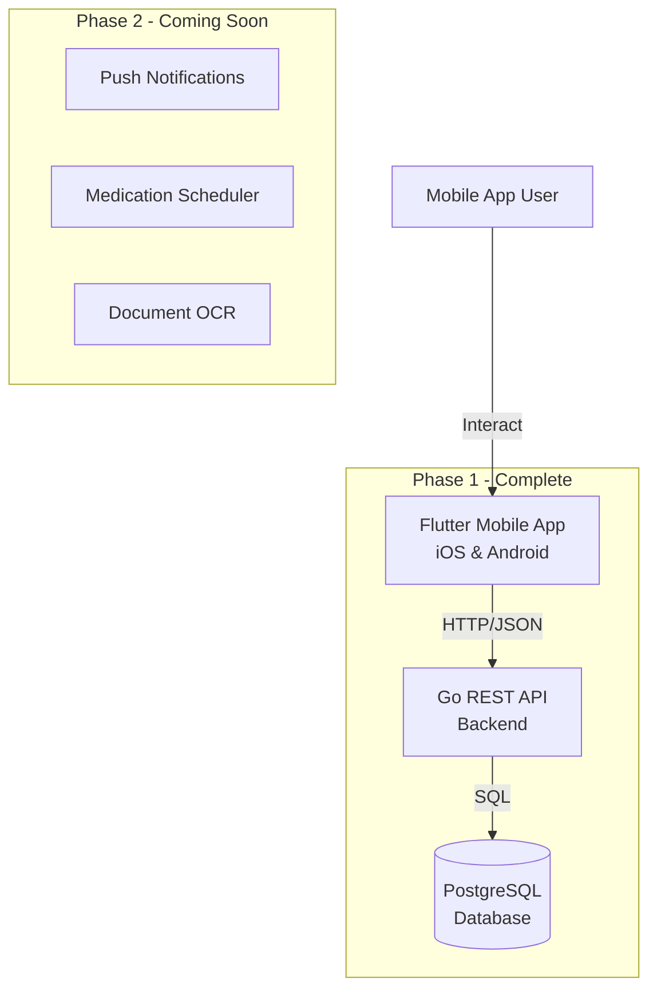

# Project Gobi

> **A sovereign personal medical assistant and records management platform.**

Project Gobi is built on the foundational principle of **data sovereignty**: providing individuals and families with a secure, private environment to manage their health records, medications, and clinical data without exposing sensitive medical information to third-party data brokers or risk-profiling insurance aggregators.

---

## 🌟 Core Principle: Data Sovereignty

Modern health platforms often monetize or leak patient data, creating risks of insurance premium inflation and unauthorized profiling. **Gobi** ensures:
- **Zero Third-Party Data Monetization:** User health data remains strictly personal and user-controlled.
- **Secure Access Control:** Time-bound, view-only sharing for doctor consultations and second opinions.
- **User-Owned Vault:** Centralized medical history, consultation transcripts, and diagnostics stored securely.

---

## 🎯 Target Demographics

1. **The Household Caregiver (Ages 30–45)**
   - Manages healthcare for 2 to 6 dependents (children, aging parents with chronic conditions like diabetes or hypertension).
   - Needs automated adherence tracking, inventory alerts, and consolidated family records.

2. **The Self-Diagnosing Professional**
   - Health-conscious professionals dealing with sedentary lifestyle challenges (fatigue, lethargy, nutritional deficiencies).
   - Needs lightweight tracking for vitals, fitness indicators, and daily supplement schedules (e.g., Vitamin D3, B12).

---

## 🚀 MVP Roadmap & Capabilities

| Module | Description | Status |
| --- | --- | --- |
| **Mobile App Platform** | Flutter mobile app (iOS/Android) with authentication and navigation | ✅ **Phase 1 Complete** |
| **Medication Management** | Track medications, set reminders, manage inventory | Phase 2 |
| **Digital Report Archival** | Snap physical reports/prescriptions for OCR, indexing, and search. | Phase 2 |
| **Dependent Management** | Dedicated profiles for up to 6 family members with distinct schedules. | Phase 3 |
| **Consultation Transcription** | Voice recording of doctor visits with clinical term extraction & follow-up tracking. | Phase 4 |
| **Secure Second Opinion Link** | Ephemeral, view-only links to share medical dossiers with consulting doctors. | Phase 4 |

---

## 📱 Phase 1 Complete: Mobile App Platform

Instead of WhatsApp (which has cost and reliability concerns), we've built a **native mobile application** using Flutter for both iOS and Android.

### ✅ Implemented Features (Phase 1)

- **Mobile App Foundation**
  - Cross-platform Flutter app (iOS + Android)
  - Beautiful, health-themed UI with Material Design 3
  - Light and Dark mode support

- **User Authentication**
  - Secure registration and login
  - JWT-based authentication
  - Session persistence (auto-login)

- **Dashboard & Navigation**
  - Home screen with health overview
  - Bottom navigation: Home, Medications, Documents, Family, Settings
  - User profile management

- **Backend API**
  - RESTful Go API with Gin framework
  - PostgreSQL database
  - User authentication endpoints
  - Profile management
  - Docker-ready deployment

### 🎯 Core Architecture



### 🔮 Coming Next (Phase 2)

1. **Medication Management**
   - Add medications with dosage schedules
   - Push notifications for medication reminders
   - Inventory tracking with refill alerts
   - Adherence tracking and history

2. **Document Scanning**
   - Camera integration for scanning prescriptions
   - OCR text extraction from medical reports
   - Secure document storage and search

---

## 🏗️ Technical Stack

### Mobile App (Flutter)
- **Framework:** Flutter 3.x
- **Language:** Dart 3.x
- **State Management:** Riverpod 2.x
- **Networking:** Dio (HTTP client)
- **Storage:** SharedPreferences, Hive
- **UI:** Material Design 3, Google Fonts

### Backend API (Go)
- **Language:** Go 1.21+
- **Framework:** Gin (HTTP router)
- **Database:** PostgreSQL 15+
- **Authentication:** JWT tokens
- **Security:** bcrypt password hashing
- **Deployment:** Docker + Docker Compose

---

## 📂 Project Structure

```text
gobi/
├── README.md
├── SETUP_GUIDE.md              # Complete setup instructions
├── backend-api/                # Go REST API
│   ├── cmd/server/            # Application entry point
│   ├── internal/
│   │   ├── api/               # HTTP handlers
│   │   ├── auth/              # JWT & password hashing
│   │   ├── config/            # Configuration
│   │   ├── database/          # DB connection & migrations
│   │   ├── middleware/        # Auth, CORS middleware
│   │   └── models/            # Data models
│   ├── Dockerfile
│   ├── docker-compose.yml     # PostgreSQL + API
│   └── README.md
├── gobi-mobile/               # Flutter mobile app
│   ├── lib/
│   │   ├── main.dart         # App entry point
│   │   ├── core/             # Config, theme, providers
│   │   ├── data/             # API client, models, repos
│   │   └── features/         # UI screens by feature
│   │       ├── auth/         # Login, Register
│   │       ├── home/         # Dashboard
│   │       ├── medications/  # Medications (placeholder)
│   │       ├── documents/    # Documents (placeholder)
│   │       ├── family/       # Family (placeholder)
│   │       └── settings/     # Settings, Profile
│   ├── pubspec.yaml
│   └── README.md
└── communication-gateway/     # WhatsApp gateway (archived)
```

---

## 🚀 Quick Start

### Prerequisites
- **Docker & Docker Compose** (for backend)
- **Flutter SDK 3.0+** (for mobile app)
- iOS Simulator OR Android Emulator

### 1. Start Backend
```bash
cd backend-api
docker-compose up -d
```

### 2. Configure Backend URL & Environment Variables
The mobile app defaults to `http://127.0.0.1:8000` with automatic Gradle `adb reverse` tunneling for Android devices. To specify a custom host or Wi-Fi LAN IP at build/run time without changing code:
```bash
flutter run --dart-define=API_BASE_URL=http://192.168.0.109:8000
```
*(To customize the automatic ADB reverse port, set `API_BASE_URL_PORT=<port>` in your shell/environment).*

### 3. Run Mobile App

#### Linux / macOS
```bash
cd gobi-mobile
flutter pub get
flutter run
```

#### Windows (PowerShell / Command Prompt)
```powershell
cd gobi-mobile
flutter pub get

# Run on connected device (or emulator)
flutter run

# Or with custom backend IP:
flutter run --dart-define=API_BASE_URL=http://192.168.0.109:8000
```

**See [SETUP_GUIDE.md](SETUP_GUIDE.md) for detailed instructions.**

---

## 📊 Success Metrics (Future)

Once medication features are implemented:
- **Reminder Interaction Rate:** % of medication reminders acknowledged within 60 minutes
- **Adherence Tracking:** Consistency of medication intake over 14-day and 30-day windows
- **Inventory Accuracy:** Correlation between app-tracked inventory and actual refill cycles
- **User Retention:** Daily/weekly active users
- **Family Profiles:** Average number of dependents managed per user
