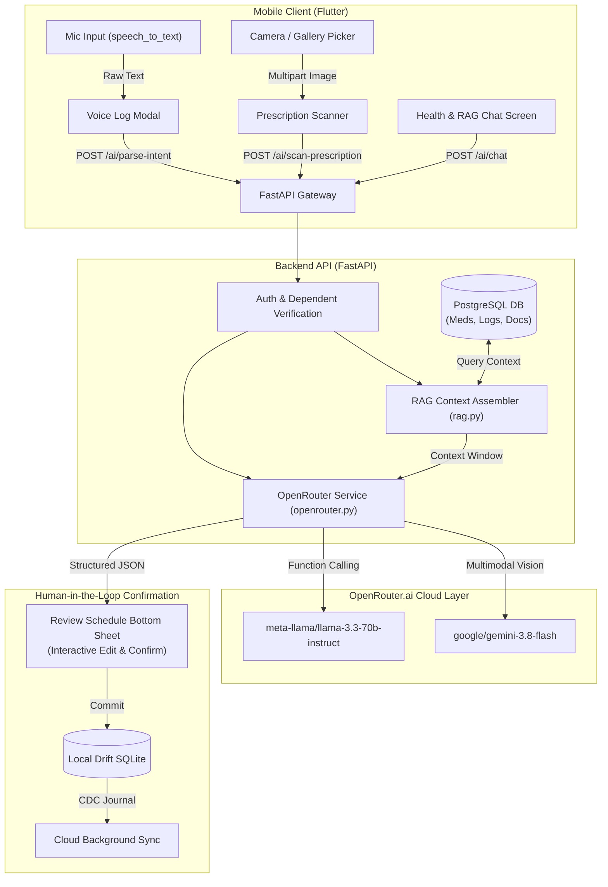
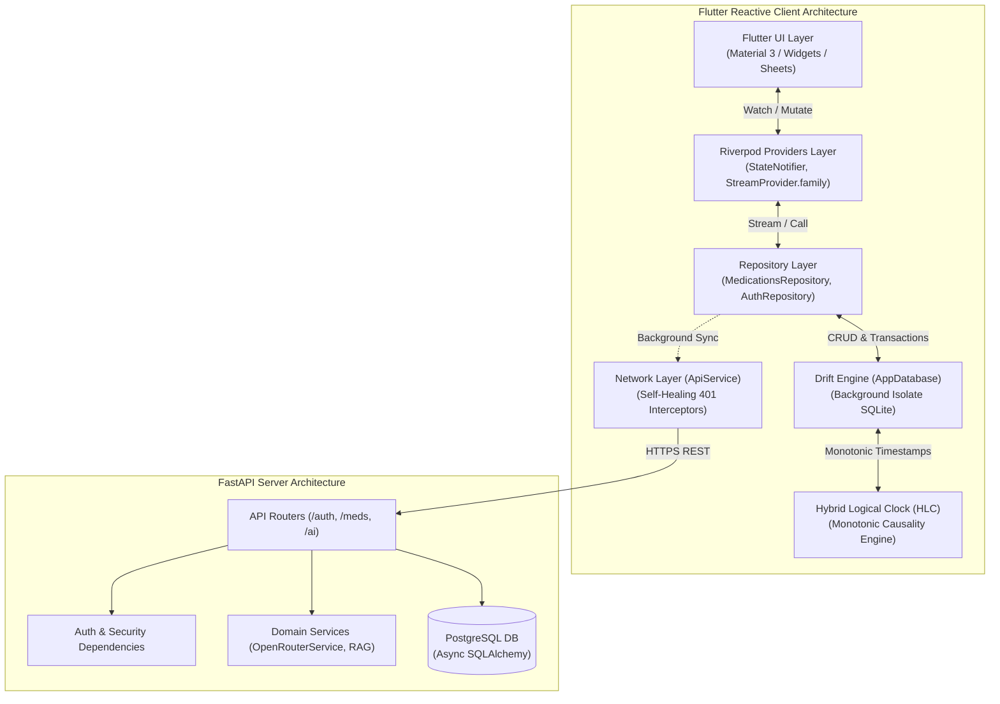

# Technical Deep-Dive: Inside Project Gobi
## Architecting a Sovereign, Local-First Personal Medical Assistant with Agentic AI

---

### Executive Summary

Modern health-tech applications are burdened by a fundamental architectural dilemma: sensitive health data requires uncompromising privacy, deterministic reliability, and instantaneous offline availability, yet modern users expect intelligent conversational reasoning, multimodal prescription scanning, and seamless multi-device synchronization.

**Project Gobi** is an open-source personal medical assistant and family health records platform engineered around the principle of **absolute data sovereignty**. Rather than treating the cloud as the mandatory center of gravity, Gobi implements a **Sovereign Local-First Architecture** where an embedded SQLite/Drift database functions as the authoritative source of truth on-device, synchronized via an append-only Change Data Capture (CDC) event log with Hybrid Logical Clocks (HLC), while interfacing with a server-backed **OpenRouter.ai** orchestration pipeline for structured voice intent extraction, multimodal prescription OCR, and Retrieval-Augmented Generation (RAG) health intelligence.

This document breaks down the end-to-end architecture, technology stack, AI runtime workflows, design patterns, and core engineering trade-offs governing the codebase.

---

## 1. Tech Stack & Infrastructure

The repository is structured as a polyglot monorepo partitioned into a cross-platform mobile client (`gobi-mobile`), an asynchronous REST/AI backend (`backend-api`), and an auxiliary communication bridge (`communication-gateway`).

```
gobi/
├── gobi-mobile/               # Flutter 3.x / Dart 3.x Client (Local-First SQLite + Riverpod)
│   ├── lib/
│   │   ├── core/              # Config, theme, API/Voice services, Riverpod providers
│   │   ├── data/              # Drift database, HLC, tables, repositories
│   │   └── features/          # Dashboard, Meds, AI Chat, Docs, Family, Settings
│   └── pubspec.yaml
├── backend-api/                # FastAPI / Python 3.12 Backend & AI Orchestration Layer
│   ├── app/
│   │   ├── api/               # REST endpoints (/auth, /medications, /dependents, /ai)
│   │   ├── db/                # SQLAlchemy models & asyncpg connection session
│   │   ├── schemas/           # Pydantic v2 schemas & AI tool contracts
│   │   └── services/          # OpenRouter LLM service & RAG context builder
│   ├── Dockerfile
│   └── docker-compose.yml
├── communication-gateway/     # WhatsApp bridge microservice (Go 1.21 + whatsmeow)
└── docs/                      # Architecture Decision Records (ADRs) & User Stories
```

### 1.1 Mobile Application (`gobi-mobile`)
- **Language & Runtime:** [Dart 3.x](file:///home/mojozinc/workbench/gobi/gobi-mobile/pubspec.yaml#L7), [Flutter 3.x](file:///home/mojozinc/workbench/gobi/gobi-mobile/pubspec.yaml#L10) (supporting Android 15+ and iOS).
- **State Management & Dependency Injection:** [Riverpod 2.x](file:///home/mojozinc/workbench/gobi/gobi-mobile/pubspec.yaml#L14) (`flutter_riverpod`), utilizing `StateNotifierProvider` for application lifecycle and auth, alongside family-parameterized `StreamProvider.autoDispose` for reactive database queries.
- **Embedded Database Engine:** [Drift 2.16.0](file:///home/mojozinc/workbench/gobi/gobi-mobile/pubspec.yaml#L33) (`sqlite3_flutter_libs`), executing on a background isolate via `NativeDatabase.createInBackground` to eliminate UI thread frame-drops.
- **Local Key-Value & Caching:** `shared_preferences` (auth tokens, device installation identifiers) and `hive_flutter` (ephemeral local caches).
- **Hardware & Multimodal Ingestion:**
  - `speech_to_text` (7.0.0): On-device real-time acoustic speech-to-text transcription.
  - `image_picker` (1.1.2): Hardware camera capture and document gallery selection for prescriptions and lab reports.
- **Networking:** `http` (1.2.2) and `dio` (5.4.0) with custom self-healing retry middleware and multi-part upload streamers.

### 1.2 Backend API (`backend-api`)
- **Language & Framework:** Python 3.12, [FastAPI](file:///home/mojozinc/workbench/gobi/backend-api/app/main.py#L33) (ASGI framework on Uvicorn).
- **Relational ORM & Persistence:** [SQLAlchemy 2.0](file:///home/mojozinc/workbench/gobi/backend-api/app/db/models.py#L3) with native `asyncio` support and `asyncpg` driver for PostgreSQL 15+.
- **Validation & Serialization:** Pydantic v2 and `pydantic-settings` for type-safe payload validation and environment configuration.
- **Security & Token Management:** Stateless JWT authentication (HS256) with configurable TTL (default 72h) and bcrypt password hashing.
- **Infrastructure & Containerization:** Docker multi-stage builds and Docker Compose orchestration with PostgreSQL health checks and network isolation.

### 1.3 Local-First Storage & Data Management Model
The client-side persistence model is defined in [`tables.dart`](file:///home/mojozinc/workbench/gobi/gobi-mobile/lib/data/local/tables.dart) and managed by [`AppDatabase`](file:///home/mojozinc/workbench/gobi/gobi-mobile/lib/data/local/app_database.dart):

| Table | Entity Class | Primary Responsibility |
| :--- | :--- | :--- |
| `cdc_events` | `CdcEventEntry` | Append-only event log capturing every `INSERT`, `UPDATE`, and `DELETE` with serialized JSON delta, Hybrid Logical Clock (`hlcTimestamp`), originating `deviceId`, and sync state. |
| `medications` | `MedicationEntry` | Primary medication catalog storing name, strength, unit, recurrence type (`daily`, `twice_daily`, `weekly`, `as_needed`), time slots JSON, and inventory refill thresholds. |
| `dose_logs` | `DoseLogEntry` | Discrete scheduled and actual intake instances with timestamps, status (`pending`, `taken`, `skipped`, `paused`), and foreign-key relation to `medications`. |
| `dependents` | `DependentEntry` | Multi-family member profiles (self, parents, children, spouse) enabling segregated health tracking. |
| `vitals_logs` | `VitalLogEntry` | Time-series health metrics (blood pressure, blood glucose, heart rate, weight) stored with JSON payload values. |

---

## 2. AI Integration & Workflows

Gobi combines **on-device native capture** with **server-side agentic reasoning** through [OpenRouter.ai](file:///home/mojozinc/workbench/gobi/backend-api/app/services/openrouter.py). The system is designed to provide clinical intelligence while enforcing strict human-in-the-loop validation.



### 2.1 Voice Intent Extraction via Structured Tool Calling
When a user speaks into the app (e.g. *"I need to take 500mg Metformin twice daily for 6 weeks"*), the audio is transcribed on-device by `speech_to_text` and dispatched to [`POST /api/v1/ai/parse-intent`](file:///home/mojozinc/workbench/gobi/backend-api/app/api/ai.py#L31).

The backend executes an OpenRouter tool-calling request against `meta-llama/llama-3.3-70b-instruct` (or `gemini-2.0-flash-exp`) constrained by JSON Schema function declarations:
1. **`set_schedule`**: Extracts `name`, `dosage`, `frequency`, `duration_weeks`, `times`, and `instructions`. Flags `requires_confirmation = True`.
2. **`record_dose`**: Extracts `name`, `status` (`taken` / `skipped`), and `time_taken`. Flags `requires_confirmation = False` (executed immediately with instant undo).
3. **`get_schedule`**: Inspects pending doses and adherence history for a specific time window (`today`, `this_week`).

```json
{
  "name": "set_schedule",
  "description": "Schedule a new recurring or as-needed medication regimen with duration and dosage",
  "parameters": {
    "type": "object",
    "properties": {
      "name": {"type": "string"},
      "dosage": {"type": "string"},
      "frequency": {"type": "string", "enum": ["daily", "twice_daily", "weekly", "as_needed"]},
      "duration_weeks": {"type": "integer"},
      "times": {"type": "string"},
      "instructions": {"type": "string"}
    },
    "required": ["name", "frequency"]
  }
}
```

### 2.2 Multimodal Prescription OCR & Extraction Pipeline
Prescriptions and lab reports captured via `image_picker` are uploaded to [`POST /api/v1/ai/scan-prescription`](file:///home/mojozinc/workbench/gobi/backend-api/app/api/ai.py#L50).
1. The backend converts the binary stream into a Base64 Data URI with strict payload size enforcement (capped at 10 MB).
2. The payload is sent to OpenRouter Multimodal Vision (`google/gemini-3.8-flash` or `llama-3.2-11b-vision-instruct`).
3. The model prompt enforces strict JSON formatting extracting `doctor_name`, `date`, `diagnosis`, `notes`, and an array of `medications`.
4. Robust JSON extraction logic (`_extract_json_payload`) handles potential markdown fence formatting or conversational prefixes using regex extraction before deserializing to `ScanPrescriptionResponse`.
5. The extracted text and JSON payload are automatically archived into the `documents` table.

### 2.3 Context-Aware RAG Health Chat Pipeline
Gobi features an integrated conversational assistant in [`HealthChatScreen`](file:///home/mojozinc/workbench/gobi/gobi-mobile/lib/features/chat/screens/health_chat_screen.dart), backed by [`build_user_health_context`](file:///home/mojozinc/workbench/gobi/backend-api/app/services/rag.py#L7) and [`POST /api/v1/ai/chat`](file:///home/mojozinc/workbench/gobi/backend-api/app/api/ai.py#L94).

Rather than querying static vector stores, Gobi builds a **Dynamic Real-Time Patient Context Snapshot** across 4 clinical relational seams:
1. **Patient & Dependent Profile:** Active user and dependent context.
2. **Active Medication Regimens:** Active drugs, dosages, schedules, and remaining inventory counts.
3. **Recent Adherence & Dose Logs:** Full scheduled vs. actual timestamps and statuses over the past 7 days.
4. **Scanned Documents & Prescriptions:** Parsed summaries of the last 5 medical records.

This structured context is injected into a specialized medical prompt, enabling the LLM to accurately answer temporal adherence questions (e.g., *"Did I take my blood pressure medicine this morning?"*) with zero hallucination.

### 2.4 Human-in-the-Loop Safeguards & Offline Heuristic Fallback
Medical data integrity requires explicit safety mechanisms:
- **Adaptive Confirmation:** Complex schedules from Voice or OCR are surfaced in [`ReviewScheduleBottomSheet`](file:///home/mojozinc/workbench/gobi/gobi-mobile/lib/features/medications/widgets/review_schedule_bottom_sheet.dart), allowing the user to adjust drug name, strength, frequency chips, and duration before saving.
- **Instant Undo:** Simple dose markings execute immediately in local SQLite with an interactive 5-second `SnackBar` allowing single-tap restoration of dose status and inventory count.
- **Deterministic Heuristic Fallback:** If `OPENROUTER_API_KEY` is absent or the cloud is unreachable, [`_fallback_parse_intent`](file:///home/mojozinc/workbench/gobi/backend-api/app/services/openrouter.py#L159) activates a regex and keyword parser to maintain full core app functionality.

---

## 3. Architecture & Design Patterns



### 3.1 Local-First Single Source of Truth
The client does not treat the local database as a cache; **Drift SQLite is the primary source of truth**. 
- Mutations write to SQLite immediately inside atomic transactions.
- The UI observes reactive query streams (`watchAllMedications`, `watchTodayDosesWithMedication`).
- Background synchronization with the server occurs asynchronously (`_backgroundCloudCreate`, `_backgroundCloudTakeDose`) without blocking UI interactivity.

### 3.2 Append-Only Change Data Capture (CDC) & Hybrid Logical Clocks
To enable distributed multi-device synchronization without centralized lock managers, every mutation is recorded in `cdc_events`.

To order distributed events deterministically across devices whose physical clocks may drift or skew, Gobi implements a custom **Hybrid Logical Clock** in [`hlc.dart`](file:///home/mojozinc/workbench/gobi/gobi-mobile/lib/data/local/hlc.dart):
```dart
class HLC implements Comparable<HLC> {
  final int millis;
  final int counter;
  final String node;

  factory HLC.now(String nodeId, [HLC? lastHlc]) {
    final physicalMillis = DateTime.now().toUtc().millisecondsSinceEpoch;
    if (lastHlc == null || physicalMillis > lastHlc.millis) {
      return HLC(millis: physicalMillis, counter: 0, node: nodeId);
    } else {
      // Clock drift backwards or equal: increment logical counter
      return HLC(millis: lastHlc.millis, counter: lastHlc.counter + 1, node: nodeId);
    }
  }

  @override
  int compareTo(HLC other) {
    if (millis != other.millis) return millis.compareTo(other.millis);
    if (counter != other.counter) return counter.compareTo(other.counter);
    return node.compareTo(other.node);
  }
}
```
During multi-device sync replay, event conflicts are deterministically resolved via **Last-Write-Wins (LWW)** governed by strict HLC comparison.

### 3.3 Transactional Schedule Horizon Expansion
Rather than parsing complex recurrence rules (RRULE) on every render, Gobi uses a **Discrete Schedule Horizon Expansion** pattern in [`createMedicationAndGenerateDoses`](file:///home/mojozinc/workbench/gobi/gobi-mobile/lib/data/local/app_database.dart#L180):
1. When a medication is created (e.g. 500mg Metformin, twice daily at 08:00 and 20:00 for 4 weeks), a single transaction inserts the medication record.
2. It immediately iterates over the schedule horizon ($4 \times 7 = 28$ days) and inserts all 56 discrete `DoseLogEntry` rows.
3. Querying "today's pending doses" or calculating adherence ratios becomes a fast, indexed relational range query:
   ```sql
   SELECT * FROM dose_logs 
   WHERE scheduled_time BETWEEN :startOfDay AND :endOfDay 
     AND is_deleted = 0 
   ORDER BY scheduled_time ASC;
   ```
4. When a regimen is edited, future pending doses are deleted and re-expanded, leaving past recorded adherence history intact.

---

## 4. The Engineering Crucible: Core Challenges & Solutions

### 4.1 The Local-First vs. Cloud AI Tension (Evolution from OS App Actions)
- **The Challenge:** The project initially specified leveraging Android's built-in Google Assistant / Gemini via App Actions and `shortcuts.xml` (ADR 0001/0002) to achieve 100% offline zero-cost voice parsing. However, real-world development revealed that Android OS-level App Actions cannot resolve intents for sideloaded developer builds without active 24-hour Google Play Console test tool previews, and OS-level Assistant lacks clinical domain understanding and multimodal OCR capabilities.
- **The Solution (ADR 0003):** Gobi pivoted to a hybrid architecture: on-device Speech-to-Text (`speech_to_text`) combined with server-backed OpenRouter structured tool calling (`meta-llama/llama-3.3-70b-instruct`) and vision models (`gemini-3.8-flash`). To safeguard offline sovereignty, deterministic local regex and heuristic parsers serve as automatic fallbacks when disconnected.

### 4.2 Monotonic Clock Ordering Under Clock Skew
- **The Challenge:** In distributed health logging (e.g., two siblings managing medication for an elderly parent across multiple phones), physical device clocks can be inaccurate, set manually, or experience NTP step-backs. Standard timestamps lead to silent data loss or clock rollback bugs.
- **The Solution:** The custom Dart `HLC` encapsulates physical time, a logical tie-breaking counter, and a persistent UUID device node (`millis:counter:deviceId`). If the physical clock moves backwards, the HLC advances the logical counter on the last known maximum millisecond timestamp, guaranteeing strict monotonic causality.

### 4.3 Self-Healing Network Client & 401 Recovery
- **The Challenge:** Medical apps must never fail catastrophically when session tokens expire or when first-time users operate without an account.
- **The Solution:** In [`ApiService`](file:///home/mojozinc/workbench/gobi/gobi-mobile/lib/core/services/api_service.dart#L84), network requests are wrapped with a self-healing interceptor:
  ```dart
  Future<http.Response> _postAuthenticated(Uri uri, Map<String, dynamic> body) async {
    if (!isAuthenticated) await ensureAuthenticated(); // Auto anonymous guest login
    var res = await _client.post(uri, headers: _headers, body: jsonEncode(body));
    if (res.statusCode == 401) {
      clearAuth();
      await ensureAuthenticated(); // Re-authenticate and retry
      res = await _client.post(uri, headers: _headers, body: jsonEncode(body));
    }
    return res;
  }
  ```
  If an API call receives a `401 Unauthorized`, the client clears stale credentials, seamlessly provisions an anonymous guest profile or refreshes the token, and retries the in-flight request transparently.

---

## 5. Architectural Summary Table

| Dimension | Implementation Details |
| :--- | :--- |
| **Primary Languages** | Dart (Flutter Client), Python (FastAPI Backend), Go (WhatsApp Gateway). |
| **Persistence Engine** | SQLite via Drift (Client Primary Store), PostgreSQL via SQLAlchemy/asyncpg (Backend Sync Store). |
| **Distributed Ordering** | Monotonic Hybrid Logical Clock (`HLC.dart`) with append-only `cdc_events` ledger and LWW conflict convergence. |
| **AI Orchestration** | OpenRouter.ai (`Llama-3.3-70b`, `Gemini-3.8-Flash`) with JSON Schema Tool Calling & Multimodal Vision. |
| **Clinical RAG Engine** | Dynamic context aggregation across profiles, active meds, 7-day adherence logs, and scanned prescriptions. |
| **Safety Guardrails** | Interactive `ReviewScheduleBottomSheet` confirmation, 5s Instant Undo for dose logging, and local heuristic fallbacks. |
| **Networking Resilience** | Self-healing guest auto-login, transparent 401 retry interceptors, and non-blocking background synchronization. |
