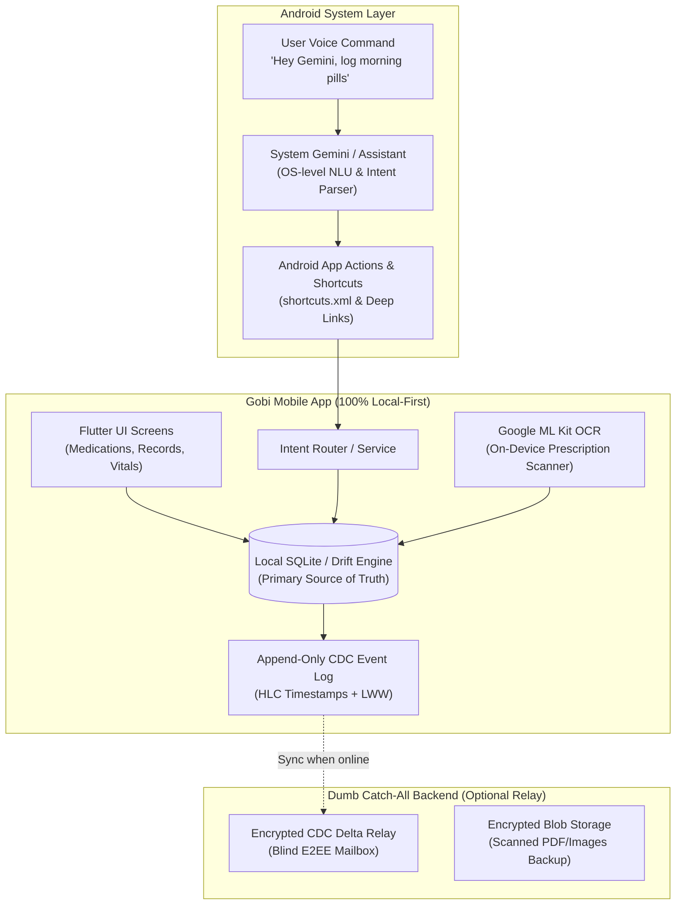

# ADR 0001: Sovereign Local-First Architecture, CDC Replication, and System AI (Gemini Android) Interface

- **Status:** Accepted
- **Date:** 2026-08-31
- **Author:** Team Gobi
- **Context:** Project Gobi Architecture Refinement

---

## 1. Context & Problem Statement

Project Gobi is built on the principle of **absolute medical data sovereignty**: individuals and families must be able to manage their prescriptions, clinical records, and health journals without exposing sensitive personal data to third-party brokers, centralized cloud aggregators, or recurring cloud API costs.

The initial prototype utilized a traditional client-server architecture with a Go/PostgreSQL backend. However:
1. Medical management must remain 100% operational offline (e.g., during travel, hospital basements, power outages).
2. Centralized databases create single points of failure, privacy liabilities, and ongoing infrastructure maintenance.
3. Modern mobile operating systems (especially Android 15+) now provide powerful on-device system AI (Google Gemini / Google Assistant), native high-speed OCR (Google ML Kit), and embedded database capabilities.

---

## 2. Decision Summary

We are transitioning Project Gobi to a **Sovereign Local-First Architecture** with the following foundational pillars:



---

## 3. Detailed Architecture Specifications

### A. Local-First Database & CDC Engine

- **Primary Database:** Embedded SQLite managed via **Drift** (type-safe, reactive Dart persistence).
- **CDC (Change Data Capture) Strategy:** Append-only `cdc_events` table tracking every entity insert, update, and soft delete with a **Hybrid Logical Clock (HLC)** timestamp and originating `device_id`.
- **Conflict Resolution:** Last-Write-Wins (LWW) applied at the field/record level during peer or cloud replay.

#### Schema Definition (Drift / SQLite):

```sql
-- CDC Change Log Table
CREATE TABLE cdc_events (
    id TEXT PRIMARY KEY NOT NULL,          -- UUID
    entity_type TEXT NOT NULL,             -- 'medication', 'dose_log', 'profile', etc.
    entity_id TEXT NOT NULL,               -- UUID of target row
    operation TEXT NOT NULL,               -- 'INSERT', 'UPDATE', 'DELETE'
    payload TEXT NOT NULL,                 -- JSON snapshot of mutated fields
    hlc_timestamp TEXT NOT NULL,           -- Hybrid Logical Clock ISO-8601 string
    device_id TEXT NOT NULL,               -- Unique device identifier
    is_synced INTEGER NOT NULL DEFAULT 0,  -- 0: pending sync, 1: synced
    created_at INTEGER NOT NULL            -- Local epoch millis
);

-- Core Medication Table (Local First)
CREATE TABLE medications (
    id TEXT PRIMARY KEY NOT NULL,
    name TEXT NOT NULL,
    dosage TEXT NOT NULL,
    unit TEXT NOT NULL,                    -- 'mg', 'ml', 'tablet'
    frequency_type TEXT NOT NULL,          -- 'daily', 'as_needed', 'weekly'
    times_of_day TEXT NOT NULL,            -- JSON array e.g. ["08:00", "20:00"]
    inventory_count INTEGER NOT NULL DEFAULT 0,
    refill_threshold INTEGER NOT NULL DEFAULT 5,
    dependent_id TEXT NOT NULL,            -- Family member UUID
    created_at TEXT NOT NULL,
    updated_at TEXT NOT NULL,
    is_deleted INTEGER NOT NULL DEFAULT 0
);
```

---

### B. System AI (Android Gemini) Interface

Instead of bundling heavy on-device LLMs or paying per-token cloud API fees, Gobi leverages the host OS's existing **System Gemini / Google Assistant** via **Android App Actions, Dynamic Shortcuts, and App Functions**.

#### Voice & Intent Interaction Matrix:

| User Voice Trigger | System Gemini Interpretation | App Action / Intent Target | Gobi Action Performed |
| :--- | :--- | :--- | :--- |
| *"Hey Gemini, log that I took my morning Metformin in Gobi"* | Intent: `actions.intent.RECORD_MEDICATION` | `gobi://intent/medication/log?name=Metformin&status=taken` | Writes `dose_logs` entry directly to local SQLite + triggers CDC event. |
| *"Hey Gemini, what medications do I have left today in Gobi?"* | Intent: `actions.intent.GET_MEDICATION_SCHEDULE` | `gobi://intent/medication/schedule?date=today` | Returns pending doses list to system overlay / opens Today's Schedule view. |
| *"Hey Gemini, open my prescription scanner in Gobi"* | Custom Shortcut: `action_scan_prescription` | `gobi://intent/camera/ocr-scan` | Launches local Google ML Kit document camera. |

---

### C. 100% Local-First OCR & Document Parsing

1. **Scanner:** Android Document Scanner API + Google ML Kit Text Recognition v2.
2. **Local Entity Parser:** Deterministic Regex and heuristic dictionary matcher running in a Dart background isolate to extract:
   - Drug Name (e.g. *Metformin*, *Atorvastatin*, *Amoxicillin*)
   - Strength / Dosage (e.g. *500mg*, *10ml*, *1 tablet*)
   - Frequency (e.g. *Once daily*, *Twice a day with meals*, *PRN*)
   - Prescribing Doctor and Date.
3. **Zero Network Requirement:** Processing completes in < 300ms entirely on-device.

---

### D. The "Dumb Catch-All" Backend Role

The backend server is decoupled from core app functionality:
1. **Zero Plaintext Storage:** The server acts as a blind, end-to-end encrypted (E2EE) mailbox relaying encrypted CDC delta packets between family devices.
2. **Progressive Elimination:** If no backend is configured or the user operates standalone, Gobi functions with 100% feature parity.
3. **Doctor Link Dossier (Optional):** Generates client-encrypted, password-protected, ephemeral web dossiers for physician consultations.

---

## 4. Implementation Roadmap

1. **Phase 1 (Foundation):** Integrate Drift SQLite engine with `cdc_events` journaling in `gobi-mobile`.
2. **Phase 2 (Medication Core):** Build local-first medication schedules, reminders (local notifications), and inventory management.
3. **Phase 3 (System Gemini Actions):** Configure Android `shortcuts.xml`, intent filters, and deep-link handler services.
4. **Phase 4 (On-Device OCR):** Integrate Google ML Kit text recognition for offline prescription ingestion.
5. **Phase 5 (Dumb CDC Relay):** Implement lightweight E2EE CDC delta synchronization over WebSocket/HTTPS.
